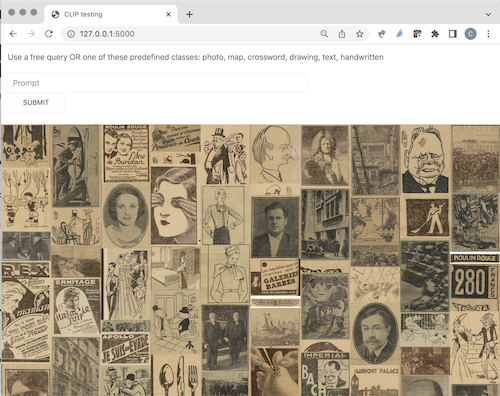
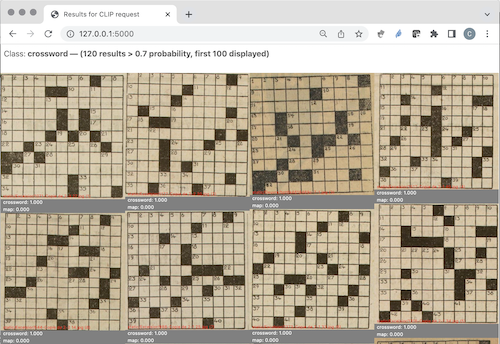
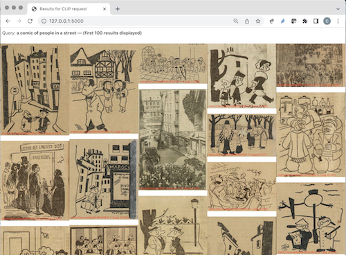

# CLIP test

This toy web app is leveraging the text-image CLIP model and a Flask web app coded by [ThorkildFregi](https://github.com/ThorkildFregi/CLIP-model-website).

*Dependencies: flask, clip, PIL, torch, numpy*


First, launch:
```
>python3 recurse.py -f static/myImages > static/myImages_directory.txt
```
if you want to process a folder of images named ``myImages`` (subfolders may be used within this folder) stored in the ``static`` application folder. It will generate the directory files list and a report as both text files.

Then the CLIP embeddings are computed with:
```
>python3 model.py -f myImages
```
The embeddings are saved in a Torch tensor named after the folder name (in our example, ``myImages_torch.pt``).

Finally, launch the web app:
```
>flask --app main.py --debug run
```
and open this URL http://127.0.0.1:5000 in your browser.

Note: the whole workflow can be run using the bash script ``run.sh``.

The web app displays a random selection of images and a prompt field.



## Classification scenario

For this use case, we want to use CLIP as a zero-shot classifier. The images types (classes) we want to classify are described in the myImages_labels.csv file as textual captions, e.g.:
```
photo, a photo
map,a map
crossword,a crossword grid
drawing,a drawing
...
```
The results list shows the most likely images for the requested class, the associated probability and the second most likely class. In this example, we are looking for crossword grids in newspapers.



## Information retrieval scenario

In this scenario, a free-form query is entered and the result list displays the images ranked in order of probability. In the example below, we are looking for cartoons of people in the street.




